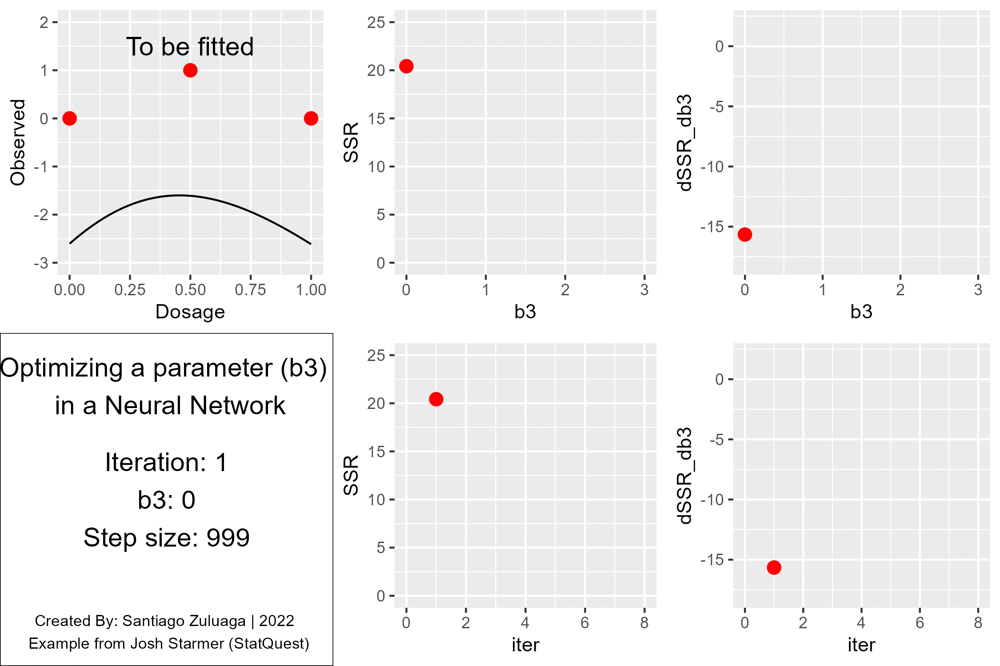

# Data Science

## Animations

### Neural Networks

Build to illustrate the example given by StatQuest with Josh Starmer in [Neural Networks Pt. 2: Backpropagation Main Ideas](https://www.youtube.com/watch?v=IN2XmBhILt4)

